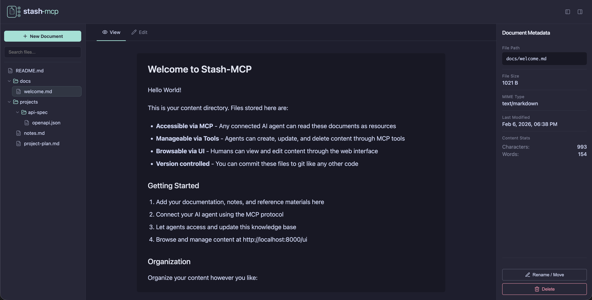

<p align="center">
  
</p>

<h1 align="center">Stash-MCP</h1>

<p align="center">
  A file-backed content server that exposes documents to AI agents via the Model Context Protocol (MCP).<br>
  Stash content as files, serve them as MCP resources, and let agents update them through tools.
</p>

<p align="center">
  <a href="#quick-start">Quick Start</a> •
  <a href="#features">Features</a> •
  <a href="#usage">Usage</a> •
  <a href="#configuration">Configuration</a> •
  <a href="USAGE.md">Full Docs</a>
</p>

---

## Features

- **Centralized knowledge store** — A single place to stash documentation, notes, specs, and reference material that any connected agent can access
- **File-first design** — Files on disk are the source of truth. No database layer. Inspect, edit, or manage content directly on the filesystem
- **MCP native** — Expose content as MCP resources (read path) and provide MCP tools (write path) so agents can both consume and update documentation
- **Semantic search** *(opt-in)* — Vector-based semantic search across all stashed content, powered by pluggable embedding providers
- **Human-friendly UI** — A simple web browser/viewer so humans can manage content alongside agents
- **Simple deployment** — Single Docker container with a volume mount. No external dependencies

## Architecture

```
┌─────────────────────────────────────────────┐
│  Docker Container                           │
│                                             │
│  ┌───────────┐  ┌────────────────────────┐  │
│  │  Web UI   │  │  FastAPI               │  │
│  │  Browser/ │──│  REST API              │  │
│  │  Viewer   │  │                        │  │
│  └───────────┘  └──────────┬─────────────┘  │
│                            │                │
│                 ┌──────────┴─────────────┐  │
│                 │  FastMCP Server        │  │
│                 │  - Resources (read)    │  │
│                 │  - Tools (write)       │  │
│                 │  - Notifications       │  │
│                 │  - Search (opt-in)     │  │
│                 └──────────┬─────────────┘  │
│                            │                │
│              ┌─────────────┼─────────────┐  │
│              │             │             │  │
│  ┌───────────┴──────┐ ┌────┴──────────┐  │  │
│  │  Filesystem      │ │ Search Engine │  │  │
│  │  /data/content/  │ │ (optional)    │  │  │
│  └──────────────────┘ └───────────────┘  │  │
│              │                           │  │
└──────────────┼───────────────────────────┘  │
               │                              │
      Volume Mount                            │
     ./content:/data/content                  │
```

## Tech Stack

| Component | Technology |
|-----------|------------|
| Package management | uv (or pip/venv) |
| MCP server | FastMCP |
| REST API | FastAPI |
| Content UI | HTML/CSS (FastAPI) |
| Semantic search | numpy + Pydantic AI (optional) |
| Containerization | Docker + Compose |
| Persistence | Filesystem (volume mount) |

## Quick Start

### Using Docker Compose (Recommended)

```bash
# Start the server
docker-compose up -d

# View logs
docker-compose logs -f

# Stop the server
docker-compose down
```

The server will be available at:
- REST API: http://localhost:8000
- UI: http://localhost:8000/ui
- MCP endpoint: http://localhost:8000/mcp
- Health check: http://localhost:8000/api/health

Your content will be persisted in the `./content` directory.

### MCP Client Configuration

To connect Claude Desktop (or other MCP clients) to the running container, add the following to your MCP client configuration:

```json
{
  "mcpServers": {
    "stash": {
      "url": "http://localhost:8000/mcp"
    }
  }
}
```

### Local Development

```bash
# Install dependencies with uv
uv sync

# Run the server
uv run -m stash_mcp.server

# Run tests
uv run pytest

# Run linter
uv run ruff check .
```

### Claude Desktop / MCP Client

Add to your MCP client configuration:

```json
{
  "mcpServers": {
    "stash": {
      "command": "uv",
      "args": ["run", "--directory", "/path/to/Stash-MCP", "-m", "stash_mcp.server"],
      "env": {
        "STASH_CONTENT_DIR": "/path/to/your/content"
      }
    }
  }
}
```

## Usage

### MCP Resources (Read)

Connect your MCP client to read documents:

```python
# List all available resources
resources = await client.list_resources()

# Read a specific document
content = await client.read_resource("stash://docs/architecture.md")
```

### MCP Tools (Write)

Agents can create, update, and delete content:

```python
# Create new content
await client.call_tool("create_content", {
    "path": "docs/new-doc.md",
    "content": "# New Document\n\nContent here..."
})

# Update existing content
await client.call_tool("update_content", {
    "path": "docs/existing-doc.md",
    "content": "Updated content..."
})

# Delete content
await client.call_tool("delete_content", {
    "path": "docs/old-doc.md"
})
```

### REST API

Access content via HTTP:

```bash
# List content
curl http://localhost:8000/api/content

# Get specific file
curl http://localhost:8000/api/content/docs/architecture.md

# Create/update file
curl -X PUT http://localhost:8000/api/content/docs/new.md \
  -H "Content-Type: application/json" \
  -d '{"content": "# New Doc"}'

# Delete file
curl -X DELETE http://localhost:8000/api/content/docs/old.md
```

### Web UI

Open http://localhost:8000/ui in your browser to:
- Browse the content tree
- View and edit documents
- Create new files and folders
- Search content (semantic search when enabled, filename filtering otherwise)

<p align="center">
  
</p>

## Configuration

Environment variables:

- `STASH_CONTENT_ROOT` - Content directory path (default: `/data/content`)
- `STASH_HOST` - Server host (default: `0.0.0.0`)
- `STASH_PORT` - Server port (default: `8000`)
- `STASH_LOG_LEVEL` - Logging level (default: `info`)

### Search Configuration

Semantic search is **disabled by default**. Set the following to enable it:

- `STASH_SEARCH_ENABLED` - Enable semantic search (default: `false`)
- `STASH_SEARCH_INDEX_DIR` - Directory for search index persistence (default: `/data/.stash-index`)
- `STASH_SEARCH_EMBEDDER_MODEL` - Pydantic AI embedder model (default: `sentence-transformers:all-MiniLM-L6-v2`)
- `STASH_CONTEXTUAL_RETRIEVAL` - Enable Claude-powered contextual chunk enrichment (default: `false`)
- `STASH_CONTEXTUAL_MODEL` - Model for contextual retrieval (default: `claude-haiku-4-5-20251001`)
- `ANTHROPIC_API_KEY` - Required when contextual retrieval is enabled

When search is enabled, the server exposes:
- An MCP `search_content` tool for agents
- REST endpoints at `/api/search`, `/api/search/status`, and `/api/search/reindex`
- Vector-based search in the Web UI sidebar

See [USAGE.md](USAGE.md) for detailed search setup instructions.

## License

MIT License - see [LICENSE](LICENSE) file for details.
