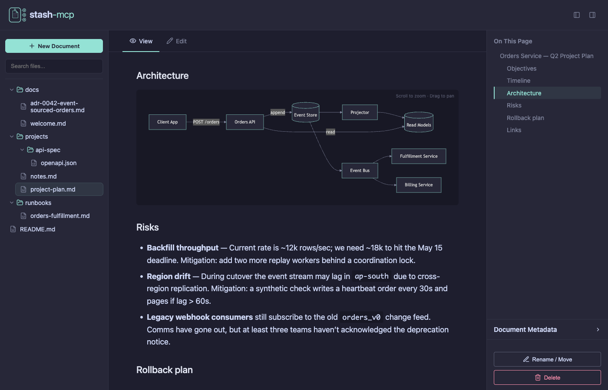
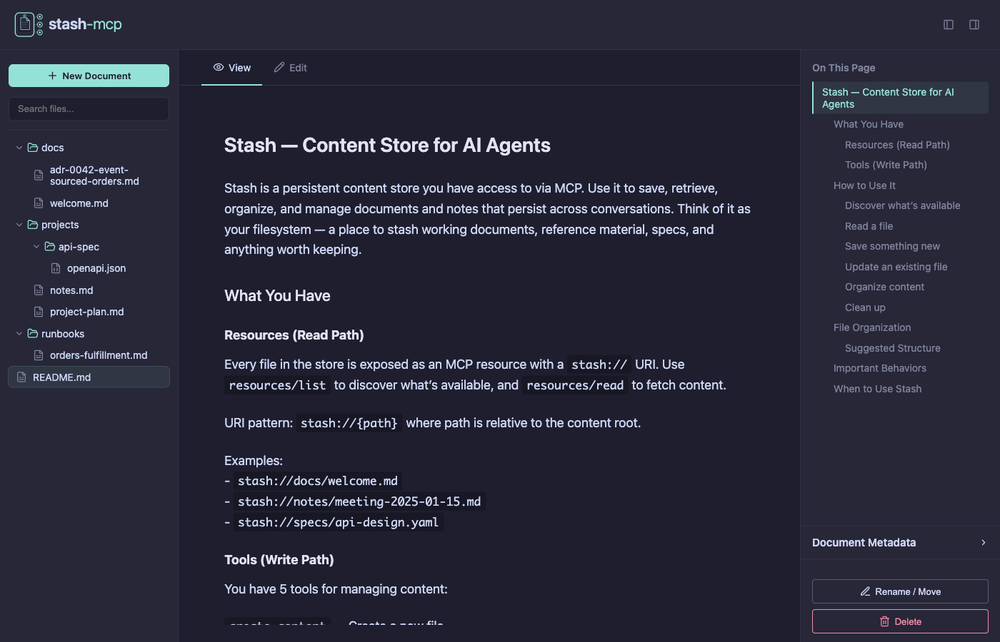
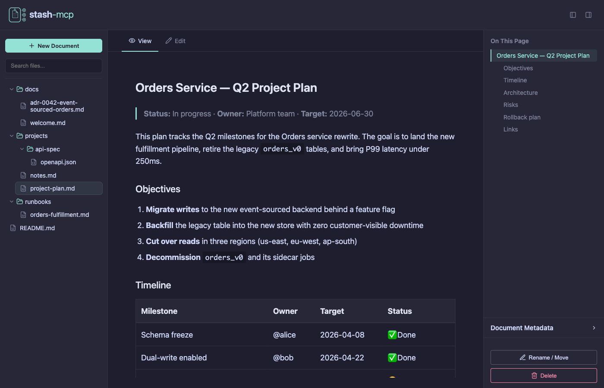
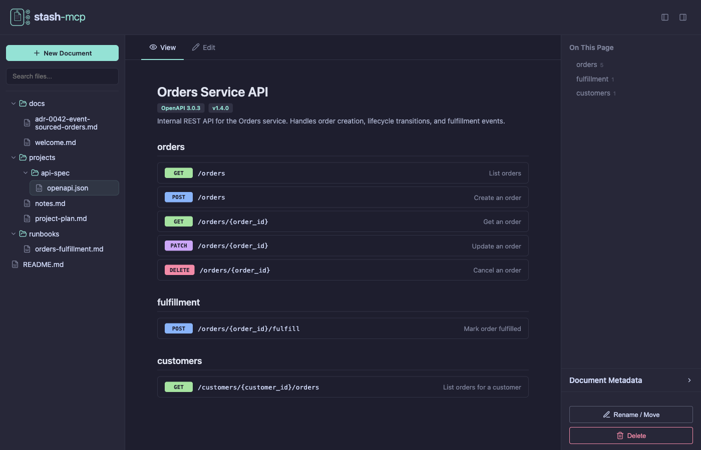
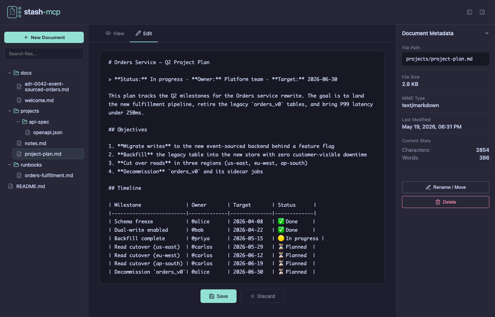
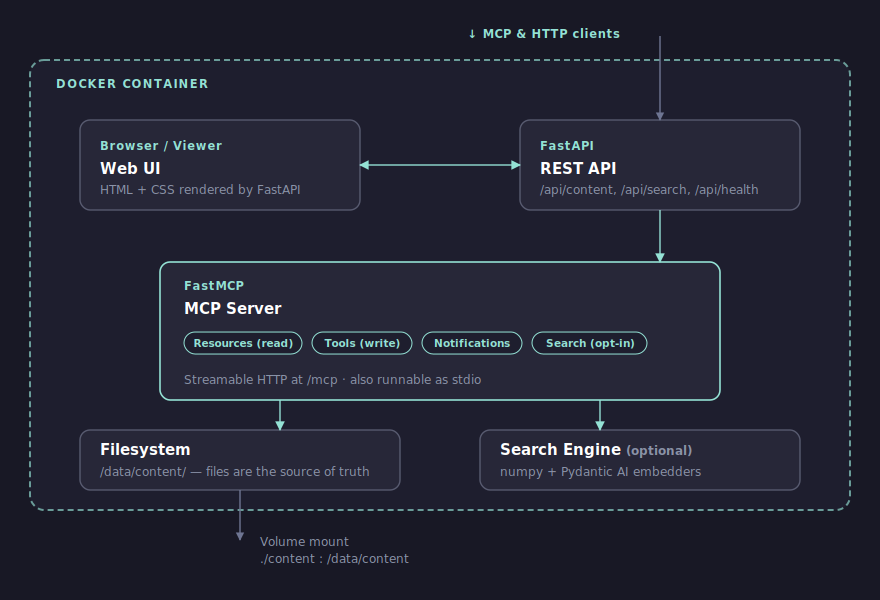

<p align="center">
  
</p>

<h1 align="center">Stash-MCP</h1>

<p align="center">
  A file-backed content server that exposes documents to AI agents via the Model Context Protocol.<br>
  Files on disk are the source of truth — agents read them as MCP resources and update them through MCP tools.
</p>

<p align="center">
  <a href="#quick-start">Quick Start</a> •
  <a href="#features">Features</a> •
  <a href="#the-ui">The UI</a> •
  <a href="#usage">Usage</a> •
  <a href="#configuration">Configuration</a> •
  <a href="USAGE.md">Full Docs</a>
</p>

<p align="center">
  
</p>

---

## Features

- **Centralized knowledge store** — One place to stash documentation, notes, specs, and reference material that any connected agent can access
- **File-first design** — Files on disk are the source of truth. No database layer. Inspect, edit, or manage content directly on the filesystem
- **MCP native** — Content is exposed as MCP resources (read path) and MCP tools (write path), so agents can both consume and update documentation
- **Rich rendering** — Markdown with Mermaid diagrams, syntax-highlighted code, and a built-in OpenAPI viewer for `.json` specs
- **Semantic search** *(opt-in)* — Vector-based search across all stashed content, with pluggable embedding providers
- **Git tracking** *(opt-in)* — File history, diffs, and blame are exposed as MCP tools; writes are gated behind atomic git-committed transactions
- **Read-only mode** — Serve reference docs to agents without allowing any modifications
- **Simple deployment** — Single Docker container with a volume mount. No external dependencies

## The UI

Stash-MCP ships with a browser UI so humans can curate the same content their agents are reading. It uses the same filesystem as the MCP server — anything an agent writes shows up immediately, and anything you write is available to the agent on the next read.

<table>
  <tr>
    <td width="50%"></td>
    <td width="50%"></td>
  </tr>
  <tr>
    <td align="center"><sub>Browse the content tree with rendered Markdown</sub></td>
    <td align="center"><sub>Tables, callouts, and headings, with an on-page outline</sub></td>
  </tr>
  <tr>
    <td width="50%"></td>
    <td width="50%"></td>
  </tr>
  <tr>
    <td align="center"><sub>OpenAPI <code>.json</code> specs render as a grouped endpoint list</sub></td>
    <td align="center"><sub>Edit content in-browser with a live metadata sidebar</sub></td>
  </tr>
</table>

## Architecture

<p align="center">
  
</p>

| Component | Technology |
|-----------|------------|
| Package management | uv (or pip/venv) |
| MCP server | FastMCP |
| REST API | FastAPI |
| Content UI | HTML/CSS (FastAPI) |
| Semantic search | numpy + Pydantic AI (optional) |
| Containerization | Docker + Compose |
| Persistence | Filesystem (volume mount) |

## Quick Start

### Claude Desktop Extension (one-click install)

The fastest way to use Stash-MCP with Claude Desktop is the `.mcpb` Desktop Extension:

1. Download `stash-mcp.mcpb` from the [latest release](https://github.com/dylanturn/Stash-MCP/releases/latest)
2. Double-click the file — Claude Desktop opens the installer
3. Set your **Content Directory** (the folder where your documents live)
4. Optionally enable **Git Tracking** or **Semantic Search**
5. Click **Install** — the Stash icon appears alongside tool calls in Claude

> **Requirements:** [uv](https://docs.astral.sh/uv/getting-started/installation/) must be installed and on your PATH.

### Docker Compose (recommended for servers)

```bash
docker-compose up -d        # start
docker-compose logs -f      # tail logs
docker-compose down         # stop
```

Endpoints:

| Endpoint | Purpose |
|---|---|
| `http://localhost:8000/ui` | Web UI |
| `http://localhost:8000/mcp` | MCP (Streamable HTTP) |
| `http://localhost:8000/api/...` | REST API |
| `http://localhost:8000/api/health` | Health check |

Your content is persisted in `./content`.

### Local development

```bash
uv sync                       # install deps
uv run -m stash_mcp.main      # run the server
uv run pytest                 # run tests
uv run ruff check .           # lint
```

## Connecting MCP clients

Once the server is running, connect Claude Desktop, Claude Code, Cursor, or any other MCP client using one of the methods below.

**Claude Desktop via `mcp-proxy`** — bridges Desktop's stdio transport to Stash-MCP's Streamable HTTP endpoint:

```json
{
  "mcpServers": {
    "stash": {
      "command": "uvx",
      "args": ["mcp-proxy", "--transport", "streamablehttp", "http://localhost:8000/mcp"]
    }
  }
}
```

> **Note:** `uvx` must be on the PATH that Claude Desktop sees. On macOS, GUI apps may not inherit your shell PATH — use the full path if needed (e.g. `/Users/you/.local/bin/uvx`).

`npx mcp-remote` works as an alternative if you have Node.js but not uv:

```json
{
  "mcpServers": {
    "stash": {
      "command": "npx",
      "args": ["-y", "mcp-remote", "http://localhost:8000/mcp"]
    }
  }
}
```

**Native Streamable HTTP** (Claude Code, Cursor, anything that supports HTTP MCP natively):

```json
{
  "mcpServers": {
    "stash": { "url": "http://localhost:8000/mcp" }
  }
}
```

Or from the CLI:

```bash
claude mcp add --transport http stash http://localhost:8000/mcp
```

**Local stdio (no container)** — run the server as a stdio subprocess directly from your MCP client config:

```json
{
  "mcpServers": {
    "stash": {
      "command": "uv",
      "args": ["run", "--directory", "/path/to/Stash-MCP", "-m", "stash_mcp.server"],
      "env": { "STASH_CONTENT_ROOT": "/path/to/your/content" }
    }
  }
}
```

## Usage

### MCP resources (read)

Every file in the content directory is exposed as an MCP resource under the `stash://` scheme:

```python
resources = await client.list_resources()
content   = await client.read_resource("stash://docs/architecture.md")
```

### MCP tools (write)

Agents create, update, move, and delete content through MCP tools:

```python
await client.call_tool("create_content", {
    "path": "docs/new-doc.md",
    "content": "# New Document\n\nContent here..."
})

await client.call_tool("update_content", {
    "path": "docs/existing-doc.md",
    "content": "Updated content..."
})

await client.call_tool("delete_content", {"path": "docs/old-doc.md"})
```

With git tracking enabled, three additional read tools are exposed: `log_content`, `diff_content`, and `blame_content`. See [Git Tracking](#git-tracking).

### REST API

The same content is accessible over HTTP:

```bash
curl http://localhost:8000/api/content                          # list
curl http://localhost:8000/api/content/docs/architecture.md     # read
curl -X PUT http://localhost:8000/api/content/docs/new.md \
     -H "Content-Type: application/json" \
     -d '{"content": "# New Doc"}'                              # write
curl -X DELETE http://localhost:8000/api/content/docs/old.md    # delete
```

### Web UI

Open `http://localhost:8000/ui` to browse the content tree, view rendered Markdown and OpenAPI specs, edit documents, and search content (semantic search when enabled, filename filtering otherwise). See [The UI](#the-ui) for screenshots.

## Configuration

Core environment variables:

- `STASH_CONTENT_ROOT` — Content directory path (default: `/data/content`)
- `STASH_HOST` — Server host (default: `0.0.0.0`)
- `STASH_PORT` — Server port (default: `8000`)
- `STASH_LOG_LEVEL` — Logging level (default: `info`)

The rest of this section covers optional modes — read-only, git tracking, sync, transactions, search, and metrics — and the full env var reference.

### Read-only mode

Set `STASH_READ_ONLY=true` to disable all write tools. The server then only exposes read resources and tools — agents can read and search content but cannot create, update, delete, or move files, and transaction tools are not registered.

Use read-only mode when serving reference documentation to agents without allowing modifications, or when exposing content from a shared volume that other processes own.

```yaml
environment:
  - STASH_READ_ONLY=true
```

### Git tracking

Set `STASH_GIT_TRACKING=true` to enable git-aware features. The content directory must already be a git repository (contain a `.git` folder).

What it enables:

- Three additional MCP tools: `log_content`, `diff_content`, and `blame_content`
- Search results enriched with `last_changed_at`, `changed_by`, and `commit_message`
- All writes (when `STASH_READ_ONLY=false`) are automatically committed to the local git repo and gated behind transactions (see [Transactions](#transactions))

```yaml
environment:
  - STASH_GIT_TRACKING=true
```

### Git sync

Set `STASH_GIT_SYNC_ENABLED=true` to have the server periodically pull from a remote git repository. Requires `STASH_GIT_TRACKING=true`.

The server pulls from `STASH_GIT_SYNC_REMOTE`/`STASH_GIT_SYNC_BRANCH` every `STASH_GIT_SYNC_INTERVAL` seconds.

**Authentication.** Provide `STASH_GIT_SYNC_TOKEN` for HTTPS token authentication. The token is injected via a local git credential helper at `.git/stash-credential-helper.sh` — no manual credential configuration is required.

**Auto-clone on startup.** Set `STASH_GIT_SYNC_URL` to the HTTPS URL of the repository. When the content directory is empty, the server clones from that URL using `STASH_GIT_SYNC_BRANCH` and `STASH_GIT_SYNC_TOKEN`, then configures the remote as `STASH_GIT_SYNC_REMOTE`. `STASH_GIT_TRACKING` is auto-enabled after a successful clone, so you don't need to set it explicitly.

```yaml
environment:
  - STASH_GIT_SYNC_ENABLED=true
  - STASH_GIT_SYNC_URL=https://github.com/org/content-repo.git
  - STASH_GIT_SYNC_BRANCH=main
  - STASH_GIT_SYNC_TOKEN=${GITHUB_TOKEN}
```

If the content directory already contains a git repository, the clone is skipped and sync proceeds as normal (the remote must already be configured):

```yaml
environment:
  - STASH_GIT_TRACKING=true
  - STASH_GIT_SYNC_ENABLED=true
  - STASH_GIT_SYNC_REMOTE=origin
  - STASH_GIT_SYNC_BRANCH=main
  - STASH_GIT_SYNC_TOKEN=${GITHUB_TOKEN}
```

### Transactions

When `STASH_GIT_TRACKING=true` and `STASH_READ_ONLY=false`, all writes are gated behind transactions. A batch of related changes is committed to git as a single atomic unit.

Workflow:

1. Call `start_content_transaction` — acquires an exclusive write lock and returns a `transaction_id`
2. Perform any number of `create_content`, `update_content`, `delete_content`, or `move_content` calls — all changes are staged
3. Call `commit_content_transaction` with the `transaction_id` — commits all staged changes to git and releases the lock
4. If something goes wrong, call `abort_content_transaction` — rolls back all staged changes and releases the lock

**Concurrency.** Only one transaction can be active at a time. A second agent attempting `start_content_transaction` waits up to `STASH_TRANSACTION_LOCK_WAIT` seconds for the lock. If the active transaction is not committed or aborted within `STASH_TRANSACTION_TIMEOUT` seconds, it is automatically aborted.

### Mode matrix

| `STASH_READ_ONLY` | `STASH_GIT_TRACKING` | `STASH_GIT_SYNC_ENABLED` | Behavior |
|---|---|---|---|
| `false` | `false` | — | Default: writes go directly to disk, no git |
| `true`  | `false` | — | Read-only: no write tools registered |
| `false` | `true`  | `false` | Writes committed to local git via transactions |
| `true`  | `true`  | `false` | Read-only + git history/blame tools available |
| `false` | `true`  | `true`  | Writes committed to git + periodic pulls from remote |
| `true`  | `true`  | `true`  | Read-only + git history/blame + auto-sync from remote |

### Docker Compose examples

**Read-only documentation server:**
```yaml
environment:
  - STASH_READ_ONLY=true
```

**Read-only with git history access:**
```yaml
environment:
  - STASH_READ_ONLY=true
  - STASH_GIT_TRACKING=true
```

**Auto-syncing from a remote repo (empty content directory — auto-clones on startup):**
```yaml
environment:
  - STASH_READ_ONLY=true
  - STASH_GIT_SYNC_ENABLED=true
  - STASH_GIT_SYNC_URL=https://github.com/org/content-repo.git
  - STASH_GIT_SYNC_BRANCH=main
  - STASH_GIT_SYNC_TOKEN=${GITHUB_TOKEN}
```

**Auto-syncing from a remote repo (content directory already initialised):**
```yaml
environment:
  - STASH_READ_ONLY=true
  - STASH_GIT_TRACKING=true
  - STASH_GIT_SYNC_ENABLED=true
  - STASH_GIT_SYNC_REMOTE=origin
  - STASH_GIT_SYNC_BRANCH=main
  - STASH_GIT_SYNC_TOKEN=${GITHUB_TOKEN}
```

**Writable with git-tracked transactions:**
```yaml
environment:
  - STASH_GIT_TRACKING=true
  - STASH_GIT_SYNC_ENABLED=true
  - STASH_GIT_SYNC_TOKEN=${GITHUB_TOKEN}
  - STASH_GIT_AUTHOR_DEFAULT=my-agent <agent@example.com>
```

### Search configuration

Semantic search is **disabled by default**. To enable:

- `STASH_SEARCH_ENABLED` — Enable semantic search (default: `false`)
- `STASH_SEARCH_INDEX_DIR` — Directory for search index persistence (default: `/data/.stash-index`)
- `STASH_SEARCH_EMBEDDER_MODEL` — Pydantic AI embedder model (default: `sentence-transformers:all-MiniLM-L6-v2`)
- `STASH_CONTEXTUAL_RETRIEVAL` — Enable Claude-powered contextual chunk enrichment (default: `false`)
- `STASH_CONTEXTUAL_MODEL` — Model for contextual retrieval (default: `claude-haiku-4-5-20251001`)
- `ANTHROPIC_API_KEY` — Required when contextual retrieval is enabled

When search is enabled, the server exposes:

- An MCP `search_content` tool for agents
- REST endpoints at `/api/search`, `/api/search/status`, and `/api/search/reindex`
- Vector-based search in the Web UI sidebar

Changing `STASH_SEARCH_EMBEDDER_MODEL` between restarts automatically clears the stale index and triggers a full rebuild with the new model.

See [USAGE.md](USAGE.md) for detailed search setup instructions.

### Local metrics

Stash-MCP collects **local, opt-out** usage metrics — nothing is sent externally. Metrics are stored in a [TinyFlux](https://github.com/citrusvanilla/tinyflux) time-series CSV file on disk and give operators visibility into tool call rates, response times, error rates, HTTP request patterns, content growth, and search performance.

Metrics are **enabled by default**. To disable:

```yaml
environment:
  - STASH_METRICS_ENABLED=false
```

| Environment Variable | Default | Description |
|---|---|---|
| `STASH_METRICS_ENABLED` | `true` | Set to `false` to disable all metrics collection |
| `STASH_METRICS_PATH` | `{STASH_CONTENT_ROOT}/../metrics.csv` | Path to the TinyFlux CSV database file |
| `STASH_METRICS_RETENTION_DAYS` | `90` | Auto-prune data points older than this many days (`0` = keep forever) |

What is collected:

- **Tool calls** — tool name, duration (ms), success/failure, error type, transport (stdio/http)
- **HTTP requests** — method, endpoint path, status code class (2xx/4xx/5xx), duration (ms)
- **Content events** — create/update/delete/move events with file extension and size
- **Search queries** — provider, hashed query, result count, duration (ms)
- **Server lifecycle** — startup and shutdown events

### Full environment variable reference

| Env Var | Default | Purpose |
|---|---|---|
| `STASH_CONTENT_ROOT` | `/data/content` | Content directory path |
| `STASH_HOST` | `0.0.0.0` | Server host |
| `STASH_PORT` | `8000` | Server port |
| `STASH_LOG_LEVEL` | `info` | Logging level |
| `STASH_READ_ONLY` | `false` | Disable all write tools |
| `STASH_GIT_TRACKING` | `false` | Enable git read tools and blame-enriched search results |
| `STASH_GIT_SYNC_ENABLED` | `false` | Enable periodic pull from remote (requires `STASH_GIT_TRACKING=true`) |
| `STASH_GIT_SYNC_URL` | — | HTTPS URL of the remote repository; when set, auto-clones into an empty content directory and auto-enables `STASH_GIT_TRACKING` |
| `STASH_GIT_SYNC_REMOTE` | `origin` | Remote name to pull from |
| `STASH_GIT_SYNC_BRANCH` | `main` | Branch to sync |
| `STASH_GIT_SYNC_INTERVAL` | `60` | Seconds between pulls |
| `STASH_GIT_SYNC_RECURSIVE` | `false` | Include submodule updates on pull |
| `STASH_GIT_SYNC_TOKEN` | — | HTTPS token for git authentication |
| `STASH_GIT_AUTHOR_DEFAULT` | `stash-mcp <stash@local>` | Fallback committer/author identity |
| `STASH_TRANSACTION_TIMEOUT` | `300` | Seconds before an active transaction is auto-aborted |
| `STASH_TRANSACTION_LOCK_WAIT` | `120` | Seconds a queued agent waits for the transaction lock |
| `STASH_SEARCH_ENABLED` | `false` | Enable semantic search |
| `STASH_SEARCH_INDEX_DIR` | `/data/.stash-index` | Search index directory |
| `STASH_SEARCH_EMBEDDER_MODEL` | `sentence-transformers:all-MiniLM-L6-v2` | Pydantic AI embedder model |
| `STASH_CONTEXTUAL_RETRIEVAL` | `false` | Enable Claude-powered contextual chunk enrichment |
| `STASH_CONTEXTUAL_MODEL` | `claude-haiku-4-5-20251001` | Model for contextual retrieval |
| `ANTHROPIC_API_KEY` | — | Required when contextual retrieval is enabled |
| `STASH_METRICS_ENABLED` | `true` | Collect local usage metrics |
| `STASH_METRICS_PATH` | `{content_root}/../metrics.csv` | TinyFlux CSV database file path |
| `STASH_METRICS_RETENTION_DAYS` | `90` | Auto-prune points older than N days (0 = keep forever) |

## License

MIT License — see [LICENSE](LICENSE) for details.
